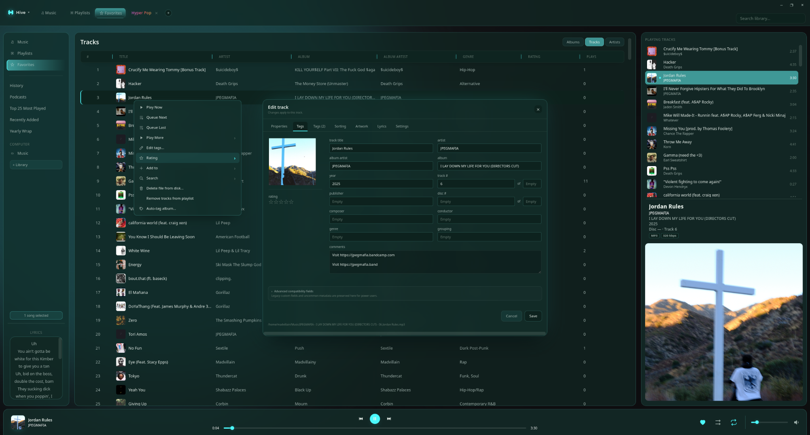
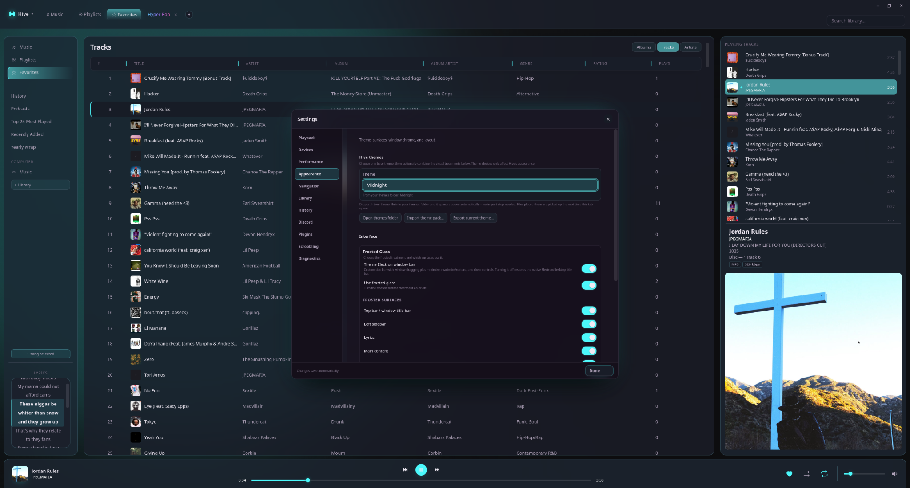

# Hive

Hive is an offline-first Linux desktop music library manager and player. It keeps
playback native through GStreamer while providing a focused Electron interface for
large local libraries, embedded metadata, multi-picture artwork, playlists, and
Favorites stored in the music files themselves.

## Status

This tree is `1.0.0-rc.1`, following the preserved `0.9.0-beta.9` baseline.
It is not a claim that every desktop, packaging, media-format, and recovery path
has been runtime-tested. See [docs/TESTING.md](docs/TESTING.md) and
[docs/RELEASE.md](docs/RELEASE.md).

## Requirements

- Linux
- Node.js and npm
- Python 3
- GStreamer 1.0 development/runtime packages and a C compiler
- `ffmpeg` and `metaflac` for the applicable metadata formats

## Development

```bash
npm ci --ignore-scripts
npm test
npm run check
npm start
```

Hive never needs access to a developer's real music library for automated tests.
Configure test folders in the app only when doing deliberate manual testing.

## Safety model

- GStreamer is the sole native playback owner.
- Embedded metadata is authoritative for Favorites/Love.
- Metadata jobs are journaled in SQLite before writes and verified after writes.
- Hive keeps metadata temporary files outside library folders and suppresses its
  own watcher events.
- The renderer is sandboxed with context isolation and a narrow preload bridge.

See [docs/ARCHITECTURE.md](docs/ARCHITECTURE.md) for system boundaries.

## Screenshots

### Favorites


### Tag Editing



### Theming


