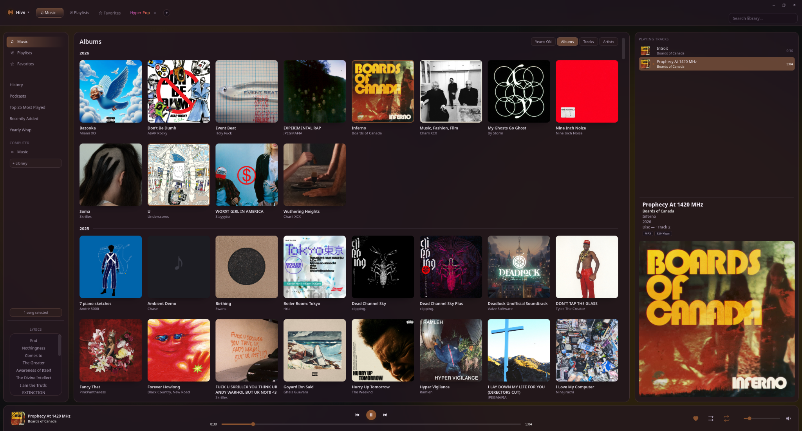
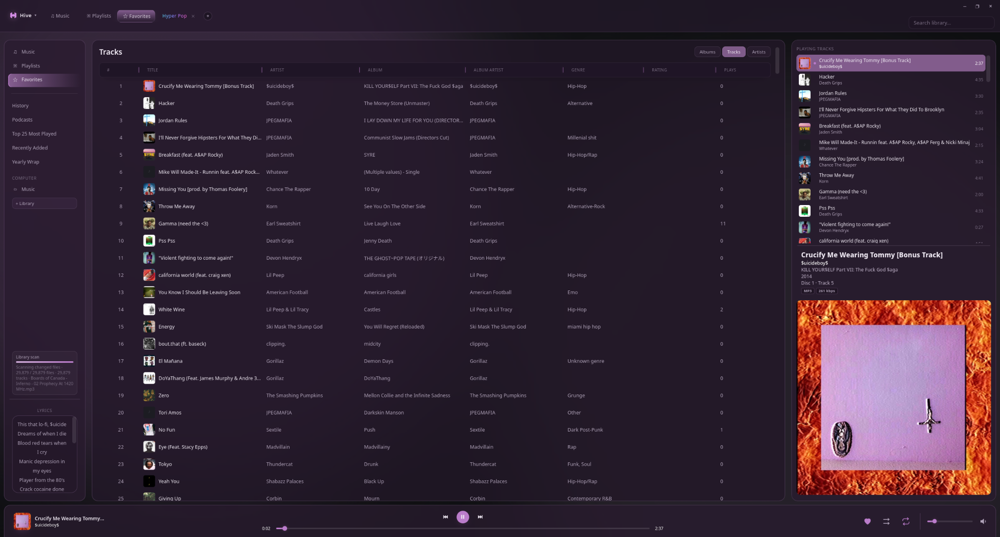
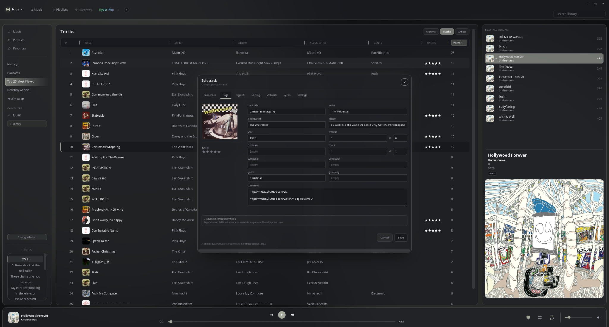
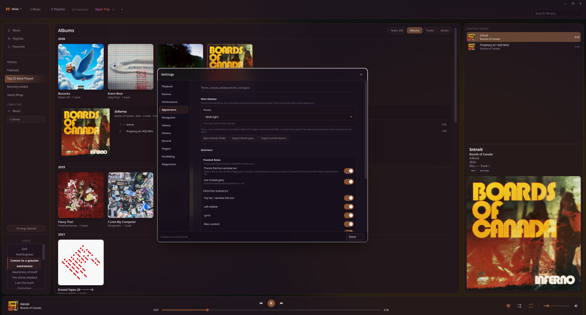
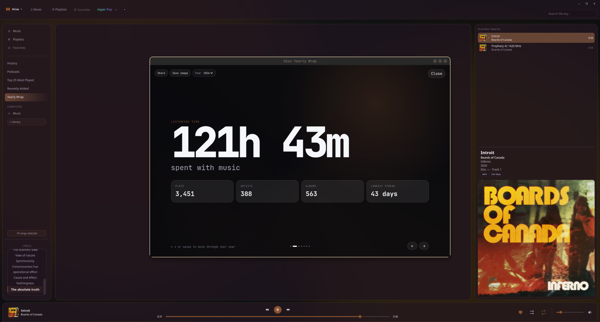
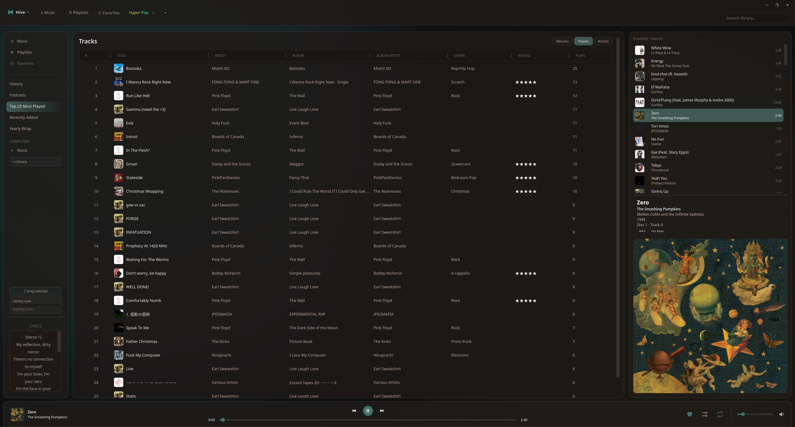

# Hive

<p align="center">
  <strong>An offline-first Linux music library manager and player.</strong>
</p>

<p align="center">
  Local music. Native playback. Your metadata stays yours.
</p>

<p align="center">
  <a href="https://github.com/MADVlLLIAN/Hive/releases">Download Hive</a>
  ·
  <a href="https://github.com/MADVlLLIAN/Hive/issues">Report an issue</a>
  ·
  <a href="https://github.com/MADVlLLIAN/Hive/blob/main/CONTRIBUTING.md">Contributing</a>
</p>

---

## Hive

Hive is a Linux-first desktop music player built around your local library. It combines native GStreamer playback with a focused Electron interface for large collections, embedded metadata, artwork, playlists, queue management, and library tools.



## Built for your library

Hive is designed around the idea that your music library should remain useful outside of any one application.

- **Native GStreamer playback** — local playback with gapless support and ReplayGain-aware behavior.
- **Embedded metadata** — Favorites, ratings, and tags are written to the music files through Hive's bundled Mutagen backend.
- **Large-library management** — scanning, MusicBrainz-assisted matching, artwork lookup, and library organization.
- **Playlists & queue** — persistent playlists, queue management, and Favorites as a first-class library view.
- **Full tag editor** — individual and bulk metadata editing, artwork, lyrics, and advanced fields.
- **Yearly Wrap** — private, local listening statistics with MusicBee Wrapped archive import.
- **Portable by design** — the application, settings, and library database can live together in one folder, including on a removable drive.
- **Local-first privacy** — your library data and listening history stay local unless you explicitly use an optional integration.

## See Hive in action

### Favorites

Hive treats Favorites as part of the library itself, with the same browsing and playback workflow as the rest of your collection.



### Library statistics

Browse listening history and library activity through dedicated views such as Top 25 Most Played.


### Tag editing

Edit track metadata without leaving the player, including album information, ratings, comments, artwork, lyrics, and other fields.



### Themes & appearance

Customize Hive's visual treatment, including Frosted Glass surfaces and the application's overall theme.



### Yearly Wrap

Hive can turn its local play history into a private yearly listening summary.



## Installation

Download the latest release from the [GitHub Releases](https://github.com/MADVlLLIAN/Hive/releases) page, extract it, and run:

```bash
tar -xzf Hive-*.tar.gz
cd Hive
./install.sh
```

The installer sets up Hive's dependencies, Electron runtime, native GStreamer helper, desktop entry, and MPRIS integration.

### Portable mode

Hive can run as a self-contained portable installation. Keep the whole Hive folder together and it stores its application data in `Hive Data/` beside the installation.

This makes it possible to keep Hive and a music library together on an external or removable drive.

## Requirements

- Linux
- Node.js and npm
- Python 3
- GStreamer 1.0 development/runtime packages
- A C compiler
- `ffmpeg`
- `metaflac` for applicable metadata formats

## Development

```bash
npm ci --ignore-scripts
npm test
npm run check
npm start
```

Automated tests use controlled test data; Hive does not need access to a developer's real music library to run the test suite.

## Safety & data ownership

Hive is intentionally local-first:

- GStreamer is the sole native playback owner.
- Embedded metadata is authoritative for Favorites/Love.
- Metadata jobs are journaled and verified after writes.
- Metadata and artwork writes are restricted to configured library folders.
- The renderer uses context isolation and a narrow preload bridge.
- Crash reporting is local-only.
- Updates are checked and installed only with user consent.

For the deeper architecture and security model, see [`docs/ARCHITECTURE.md`](docs/ARCHITECTURE.md).

## Documentation

- [`CLAUDE.md`](CLAUDE.md) — project briefing and development rules
- [`AI-DEVELOPMENT.md`](AI-DEVELOPMENT.md) — AI-assisted development notes
- [`docs/`](docs/) — architecture and feature documentation
- [`CONTRIBUTING.md`](CONTRIBUTING.md) — contribution guide
- [`SECURITY.md`](SECURITY.md) — security policy
- [`CHANGELOG.md`](CHANGELOG.md) — development history

## License

Hive is released under the MIT License. See [`LICENSE`](LICENSE).


